# Social Media Automation System - Setup Guide

## Welcome

**Mission: Teach 1 million solo creators social media automation.**

Hello and welcome! If you're a solo creator, you know how challenging it can be to post consistently on social media. Creating content, editing, writing captions, posting... and by the time it's done, it's time to start all over again. Meanwhile, there's the creative work to focus on, time with family and friends, or just a moment to breathe.

This system was built to help with that problem. It posts content to up to 9 platforms automatically - upload to a folder and everything else happens automatically through AI-generated captions, content categories, per-platform tracking, and automated file discovery.

The original workflow existed but required too much manual work to scale for daily posting and had no documentation beyond a video claiming it was "easy" to set up. This enhanced version adds the missing automations, and this guide provides the comprehensive documentation that should have existed from the start.

Clear, step-by-step instructions to build this system once and have it post across multiple platforms without constant manual effort.

Sharing your message on social media is important, but it shouldn't take up all your time. Focus on what you love doing and let automation handle the rest.

---

## Table of Contents

---

## TL;DR - Quick Setup Overview

**Prerequisites:** Google Drive (free), Google Sheets (free), n8n (free or paid options), Blotato (paid), OpenAI API (paid)

**Setup Steps:**
1. **Google Tools:** Create MyContent folder structure → Import Google Sheet → Run Apps Script to scan files
2. **Blotato:** Register account → Connect social platforms → Copy API key
3. **n8n:** Import workflow JSON → Configure 4 credentials (Google OAuth, OpenAI, Blotato) → Activate/deactivate platform nodes → Test run

**First run:** Mark one row "Ready To Post" in Google Sheets → Execute n8n workflow → Verify post scheduled in Blotato → Check Google Sheet updated with timestamps

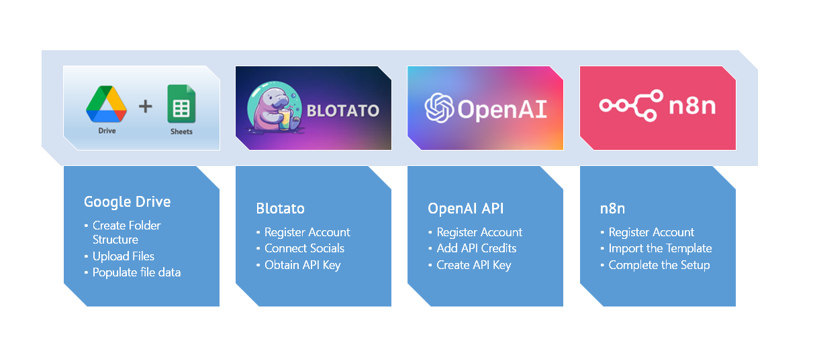

---

## Introduction

This system posts your original content to up to 9 social platforms, helping solo creators save time and resources on social media distribution without hiring a big team.

Instead of manually logging into each platform and posting the same content repeatedly, you upload once to organized folders. The system generates platform-optimized captions and hashtags, then distributes your content automatically.

**How it works:**

User uploads media files to organized cloud folders by business category. Automated system discovers new files and populates the tracking sheet with file details and default metadata. AI Agent generates platform-optimized titles, captions and hashtags based on content category. n8n workflow sends content to Blotato, which posts to all 9 platforms simultaneously. The system tracks what posted where and when for future repurposing.

**⚠️ IMPORTANT: Test with provided folder structure first**

This package includes 20 test video files (10 in "Process" folder, 10 in "Motivation" folder). You MUST set up and test the system with these folder naming conventions first. Once everything works correctly, then customize for your own content and categories.

---

## Prerequisites

Before starting setup, you need active accounts for:

1. **Google Drive** (free)
2. **Google Sheets** (free)
3. **OpenAI API** (paid)
4. **n8n** (free or paid - see Glossary for options)
5. **Blotato** (paid - includes free trial)

---

## Section 1: Google Tools Setup

### Step 1: Create Folder Structure

**What you're doing:** Setting up organized cloud storage for your content files and copying the system template.

**ACTION STEPS:**

☐ Open your Google Drive

☐ Create a new folder named `MyContent`

☐ Share MyContent folder via right-click → Select **Share** → **Anyone with the link** (Viewer permissions is ok)


`[SCREENSHOT: MyContent folder sharing settings]`

☐ Inside `MyContent`, create two subfolders:
   - `Process`
   - `Motivation`

**Your folder structure should look like:**
```
Google Drive
└── MyContent
    ├── Process
    └── Motivation
```

**Copy the Google Sheet Template:**

☐ Open the template link provided in your download package

☐ Click **File** → **Make a copy**

☐ Rename to exactly: `Social_Media_Publisher_PRO_V2.4`

**Note:** While you can use any filename, using this exact name simplifies setup since it matches the workflow documentation.

☐ Move the spreadsheet file INTO the `MyContent` folder

**Copy Test Files:**

☐ Copy the 20 test video files from your download package:
   - 10 files into the `Process` folder
   - 10 files into the `Motivation` folder

**Your final structure:**
```
Google Drive
└── MyContent
    ├── Social_Media_Publisher_PRO_V2.4 (Google Sheet)
    ├── Process (10 video files)
    └── Motivation (10 video files)
```

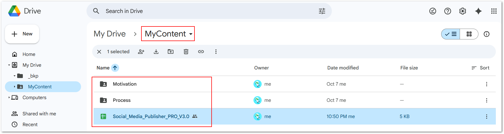

`[SCREENSHOT: Final MyContent folder structure with Google Sheet and test files]`

**Why this matters:** The Apps Script scans from the spreadsheet's location. Both the sheet and content folders must be inside `MyContent`.

---

### Step 2: Import Google Sheet

**What you're doing:** Understanding your control center for the automation system.

**ACTION STEPS:**

☐ Open the Google Sheet you just placed in `MyContent` folder

You'll see 3 tabs at the bottom: Settings, ContentData, Metadata

**Settings Tab:**
- Open this tab
- Read the note about accepted file formats (standard video: .mp4, .mov, .avi; images: .png, .jpg, .jpeg, .gif)
- See the "Update ContentData" button - you'll use this later
- See the "Enable Autotrigger" dropdown - leave as "No" for now

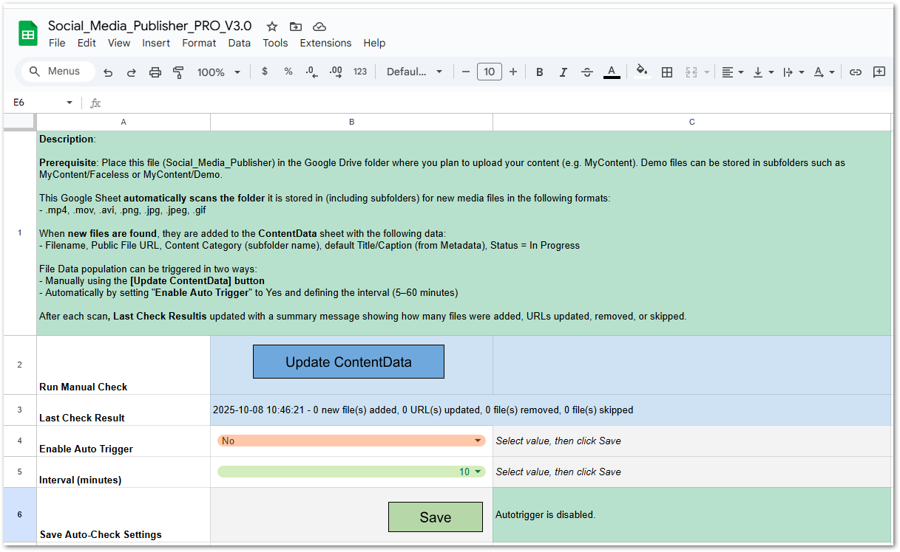

`[SCREENSHOT: Settings tab showing note, Update ContentData button, and autotrigger controls]`

**ContentData Tab:**
- Open this tab
- Review the column headers:
  - Filename, Media URL, Content Category, Title, Caption, Status
  - Platform columns (instagram, facebook, tiktok, pinterest, youtube, threads, twitter, linkedin, bluesky)
- This tab is currently empty - it will fill automatically when you run the Apps Script

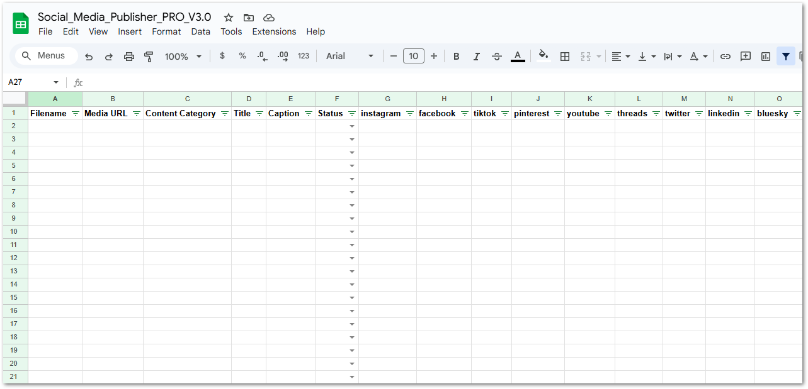

`[SCREENSHOT: ContentData tab showing column headers with empty rows]`

**Metadata Tab:**
- Open this tab
- See 2 pre-populated rows corresponding to your 2 test folders (Process, Motivation)
- Column structure:
  - **Category Folder Name:** Must match Google Drive subfolder name exactly
  - **Business Context:** Full description of audience and positioning
  - **Default Title:** Template used for new content
  - **Default Caption:** Template used for new content

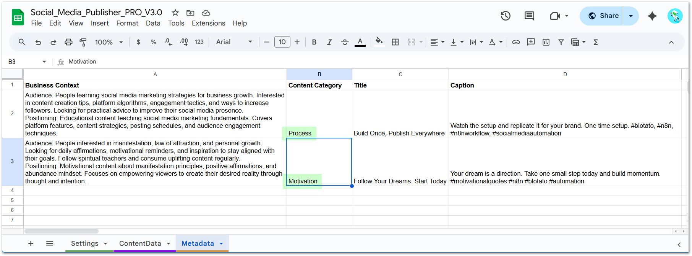

`[SCREENSHOT: Metadata tab showing 2 pre-populated example rows]`

**Pre-populated examples:**

The Metadata tab contains detailed Business Context examples for both Process and Motivation folders. Review these examples to understand the level of detail needed for the AI Agent to generate relevant content.

**Note:** Business Context is what allows the AI Agent to generate relevant titles, captions, and hashtags that match your brand voice and audience.

**Why this matters:** The AI Agent uses Business Context to generate platform-optimized captions and hashtags that match your brand voice and audience.

---

### Step 3: Load Media File Data

**What you're doing:** Automatically discovering your 20 test files and populating the tracking sheet.

**Note:** The Google Sheet includes Apps Script - Google's automation tool that scans your Drive folders and loads file data automatically.

**ACTION STEPS:**

☐ Go back to the **Settings** tab

☐ Click the **"Update ContentData"** button

**Authorization Process (First Time Only - Required by Google)**

When you click Update ContentData for the first time, Google will show you several security screens. This is normal and required for ANY Apps Script that accesses your Drive and Sheets files, even your own personal scripts. Here's what you'll see and what to do:

**Screen 1: Authorization Required**

☐ Click **"Review Permissions"**

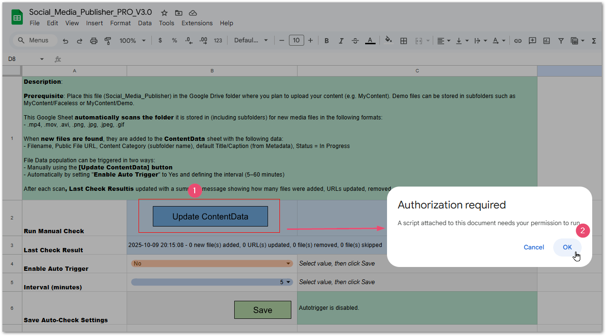

`[SCREENSHOT: Authorization required dialog]`

**Screen 2: Choose Account**

☐ Select your Google account (the one you're using for this setup)

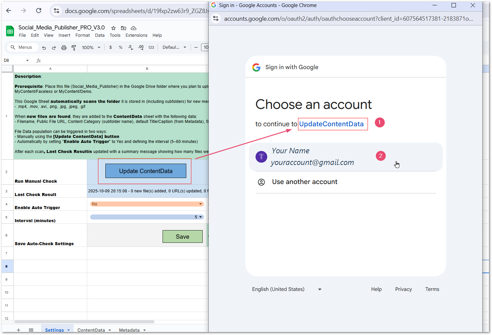

`[SCREENSHOT: Account selection screen]`

**Screen 3: Unverified App Warning**

☐ Click **"Advanced"** at the bottom left

☐ Click **"Go to [script name] (unsafe)"**

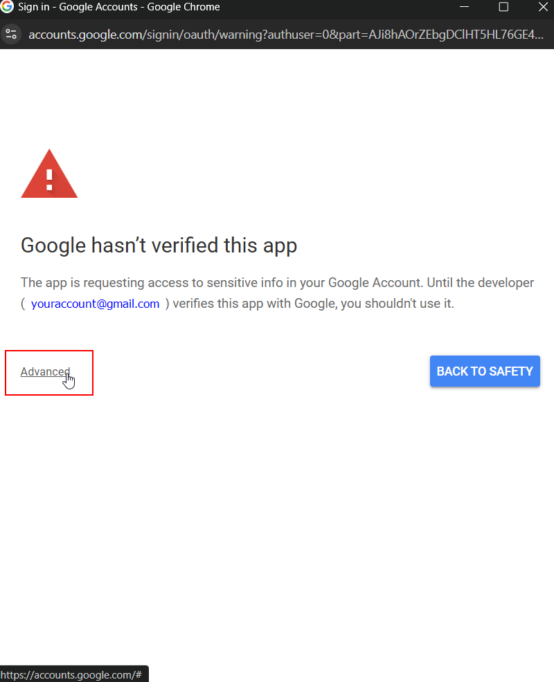

`[SCREENSHOT: Unverified app warning with Advanced button highlighted]`

**Note:** The word "unsafe" is misleading. This is YOUR script accessing YOUR files. Google shows this warning because they haven't reviewed your personal script - but it's completely safe since you created it.

**Security concerns?** A copy of the Apps Script code is provided in your download package. You can copy and paste the code into ChatGPT or any AI tool and ask it to analyze for security risks.

**Screen 4: Grant Permissions**

☐ Review the permissions list (See and download all your Google Drive files, View and manage spreadsheets)

☐ Click **"Allow"**


`[SCREENSHOT: Permission grant screen with Allow button]`

**After authorization:**

The script will run (may take 30-60 seconds for 20 files). Watch cell B3 in Settings tab for status message. When complete, you'll see a summary: "Loaded 20 new files"

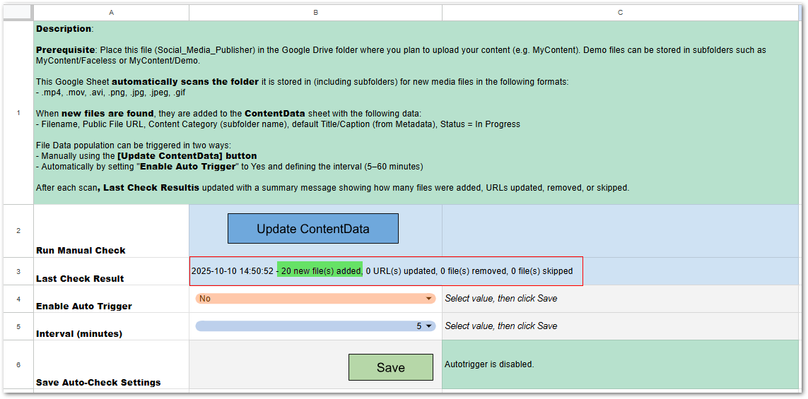

`[SCREENSHOT: Settings tab showing completion message in B3]`

**If you see an error on first run:** This can happen occasionally. Simply click **"Update ContentData"** again. The second run should work.

**Verify the results:**

☐ Switch to **ContentData** tab

You should see 20 rows of data:
- 10 rows with Content Category = "Process"
- 10 rows with Content Category = "Motivation"
- Each row has Filename, Media URL, default Title and Caption from Metadata tab
- All rows show Status = "In Progress"

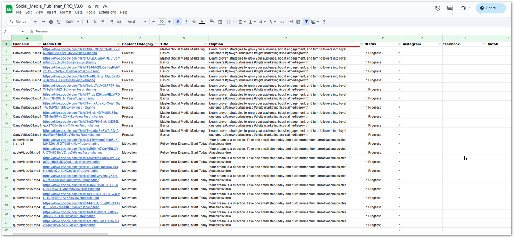

`[SCREENSHOT: ContentData tab with 20 populated rows]`

**Prepare for posting:**

☐ Pick ONE row to test with (any file from either folder)

☐ In the Status column, change status from "In Progress" to "Ready To Post"

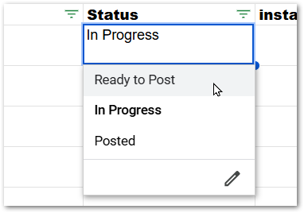

`[SCREENSHOT: Status dropdown showing options: In Progress, Ready To Post, Posted]`

☐ Leave all other rows as "In Progress"

**Why this matters:** Only rows marked "Ready To Post" will be processed by the n8n workflow. This gives you control over what posts and when.

---

## Section 2: Blotato Setup

### Step 1: Register for Blotato Account

**What you're doing:** Setting up your multi-platform posting service.

**ACTION STEPS:**

☐ Go to Blotato registration page using the affiliate link provided (or blotato.com)

☐ Create your account (free trial available)

**Why this matters:** Blotato handles the actual posting to all 9 social platforms through one API.

---

### Step 2: Connect Your Social Media Accounts

**What you're doing:** Authorizing Blotato to post on your behalf.

**ACTION STEPS:**

☐ Log into your Blotato account

☐ Navigate to the "Connect Accounts" or "Social Accounts" section

☐ Connect as many of these platforms as you want to use:
   - Instagram
   - Facebook
   - TikTok
   - Pinterest
   - YouTube
   - Threads
   - Twitter
   - LinkedIn
   - Bluesky

**You don't need all 9.** Connect only the platforms you actually use.

☐ For each platform, click "Connect" and follow the OAuth authorization flow

☐ Grant Blotato posting permissions


`[SCREENSHOT: Blotato dashboard showing connected social accounts]`

**Important note:** Later in Section 2, you'll need to activate/deactivate nodes based on which platforms you connected here. More on this in Section 3.

---

### Step 3: Get Your Blotato API Key

**What you're doing:** Getting your authentication credential for n8n to communicate with Blotato.

**ACTION STEPS:**

☐ In your Blotato dashboard, go to **Account Settings** → **API** tab

☐ Copy your API key (automatically generated upon registration)

☐ Save this key - you'll need it for n8n setup

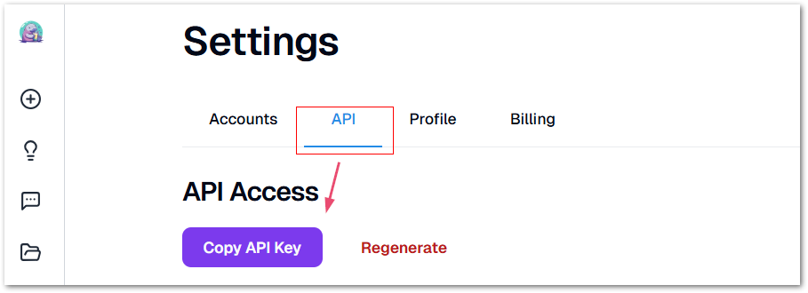

`[SCREENSHOT: Blotato settings page showing API key location]`

**For detailed instructions:** See [Blotato API documentation link - to be provided]

**Why this matters:** This API key allows n8n to send your content to Blotato for posting.

---

## Section 3: n8n Setup

### Step 1: Import Workflow and Review Instructions

**What you're doing:** Loading the pre-built automation workflow into n8n.

**ACTION STEPS:**

☐ Log into your n8n instance (cloud or self-hosted)

☐ Click **"Add Workflow"** → **"Import from File"**

☐ Select the `workflow.json` file from your download package

The workflow will load with all nodes pre-configured.

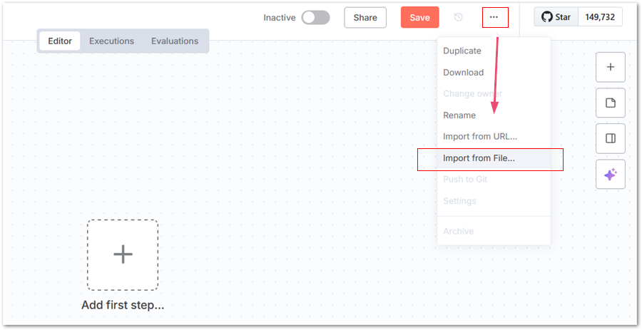

`[SCREENSHOT: n8n import dialog]`

You'll see the workflow canvas with multiple connected nodes:
- Google Drive trigger
- Google Sheets nodes
- AI Agent node with OpenAI
- Multiple Blotato posting nodes (one per platform)


`[SCREENSHOT: n8n workflow overview showing all nodes]`

**Review the workflow structure:**
- **Trigger:** Checks Google Sheets for rows with Status = "Ready To Post"
- **AI Agent:** Generates platform-specific titles, captions, hashtags
- **Blotato nodes:** Post to each platform (9 separate nodes)
- **Update Sheet:** Marks Status as "Posted" and records timestamps

**Why this matters:** Understanding the flow helps you troubleshoot issues and customize later.

---

### Step 2: Configure Credentials and Connections

**What you're doing:** Connecting n8n to your Google Drive, Google Sheets, OpenAI, and Blotato accounts.

This is the most technical step. Take your time.

**Google Drive and Google Sheets (OAuth):**

**ACTION STEPS:**

☐ Click on any Google Drive or Google Sheets node

☐ Click "Create New Credential"

☐ Follow n8n's official documentation for Google OAuth setup: [n8n Google OAuth documentation link]

**This is the most technical step.** n8n's documentation provides current, detailed instructions that account for any Google Cloud Console interface changes.

☐ After completing OAuth setup following n8n's guide, authorize n8n to access your Google account

☐ Select your Google Drive folder (MyContent) for the Google Drive node

☐ Select your Google Sheet (Social_Media_Publisher_PRO_V2.4) for the Google Sheets nodes

**OpenAI API:**

☐ If you haven't already, register at platform.openai.com

☐ Set up billing and add credit to your account

☐ Generate an API key from the API Keys section

☐ In n8n, click on the AI Agent node

☐ Click "Create New Credential" for OpenAI

☐ Enter your OpenAI API key

☐ Select model: gpt-4 or gpt-3.5-turbo (depending on your preference)

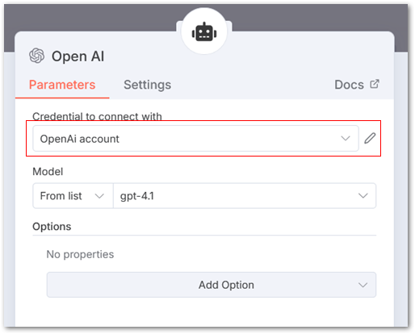

`[SCREENSHOT: n8n OpenAI credential setup]`

**Blotato API:**

☐ Click on any Blotato node

☐ Click "Create New Credential"

☐ Enter your Blotato API key from Section 2, Step 3

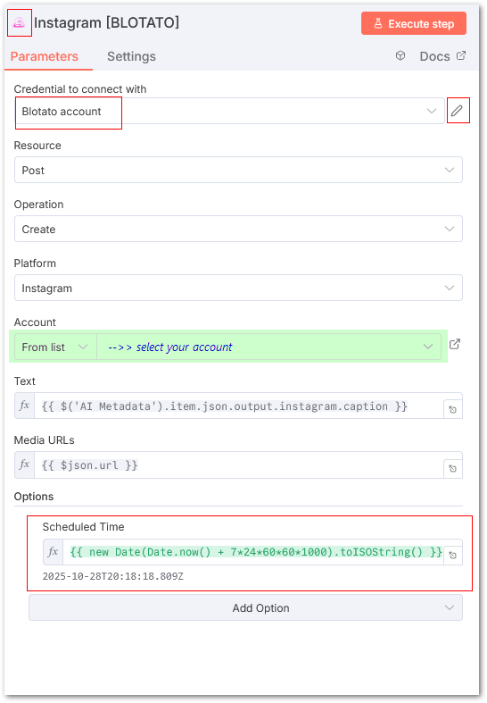

`[SCREENSHOT: n8n Blotato credential setup]`

**Activate/Deactivate Platform Nodes:**

☐ Look at the 9 Blotato posting nodes (Instagram, Facebook, TikTok, etc.)

☐ Right-click any platform you did NOT connect in Blotato → Select "Deactivate"

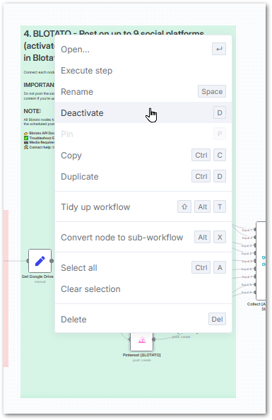

`[SCREENSHOT: n8n showing how to deactivate a node]`

☐ Only keep active the platforms you connected in Section 2

**Why this matters:** Credentials allow n8n to access your services. Deactivating unused platforms prevents errors.

---

### Step 3: Show Time - First Test Run

**What you're doing:** Running the workflow manually to verify everything works.

**Pre-flight check:** ✈️
- ✓ Google Sheet has 20 rows in ContentData
- ✓ At least ONE row has Status = "Ready To Post"
- ✓ All credentials configured in n8n
- ✓ Only connected platforms are active in workflow

**Execute the workflow:**

**ACTION STEPS:**

☐ In n8n workflow canvas, click **"Execute Workflow"** button at the bottom

Watch the nodes light up as they process. Execution should take 30-60 seconds.


`[SCREENSHOT: n8n workflow executing with nodes lighting up]`

**Success indicators:**

**In n8n:**
- All active nodes show green checkmarks
- No red error indicators
- Output data visible in each node

**In Blotato:**

☐ Log into your Blotato dashboard

☐ Go to "Calendar"

You should see your test post scheduled for 7 days from now. **This is intentional** - posts are scheduled in the future so you can test safely and delete if needed.

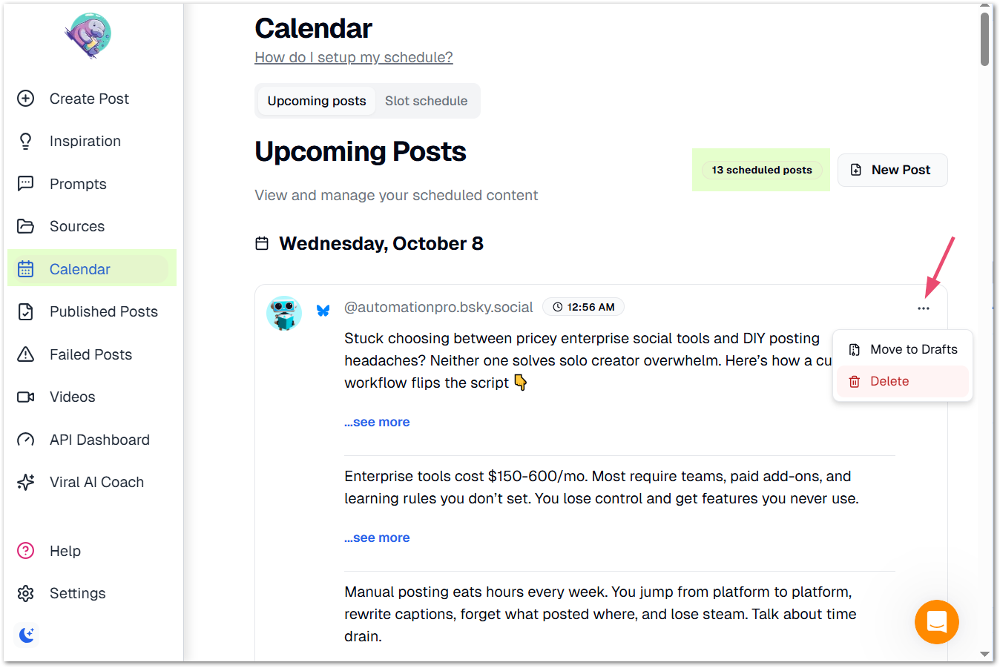

`[SCREENSHOT: Blotato dashboard showing scheduled post]`

**In Google Sheets:**

☐ Open your ContentData tab

☐ Find the row you marked "Ready To Post"

Verify these updates:
- Status changed from "Ready To Post" to "Posted"
- Each connected platform column shows:
  - Date/time stamp
  - Platform-specific title (for YouTube)
  - Platform-specific caption
  - Platform-specific hashtags

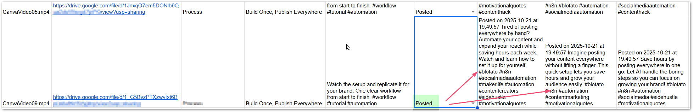

`[SCREENSHOT: ContentData tab showing updated row with timestamps and captions]`

**If you see all these success indicators: Congratulations! Your system is working.**

**What to do with the scheduled test post:**

☐ Go back to Blotato dashboard

☐ Go to "Calendar"

☐ Find the scheduled post

☐ Either delete it, let it publish in 7 days, or edit the schedule

**Test with more content:**

☐ Change another row's Status to "Ready To Post" → Run the n8n workflow again → Repeat until confident

**Why this matters:** Manual testing verifies all components work together before you rely on automation.

---

## Section 4: Troubleshooting

### Common Issue 1: Apps Script Permission Errors

**Symptom:** When clicking "Update ContentData", you see "Authorization required" repeatedly, or script fails to run.

**Solutions:**
1. Clear your browser cache and cookies
2. Try a different browser
3. Make sure you clicked "Advanced" → "Go to [script name]" in the authorization dialog
4. If script is embedded and won't authorize, use the standalone `.gs` file from your package:
   - In Google Sheets, go to Extensions → Apps Script
   - Delete existing code
   - Paste code from the `.gs` file
   - Save and try again

---

### Common Issue 2: n8n Credential Connection Failures

**Symptom:** Red error indicators on nodes saying "Credentials are not valid" or "Authentication failed"

**Solutions:**

**For Google OAuth:**
1. Verify you enabled both Google Drive API AND Google Sheets API in Google Cloud Console
2. Check that your OAuth redirect URI in Google Cloud Console exactly matches what n8n provides
3. Try disconnecting and reconnecting the credential
4. Generate a new OAuth token

**For OpenAI:**
1. Verify your API key is still valid at platform.openai.com
2. Check you have available credit/billing set up
3. Make sure there are no extra spaces when pasting the API key

**For Blotato:**
1. Verify the API key is copied exactly (no spaces)
2. Check your Blotato account is active (not expired trial)
3. Try regenerating the API key in Blotato settings

---

### Common Issue 3: Wrong File Formats

**Symptom:** Apps Script loads files but they don't appear in ContentData, or n8n fails to process certain files.

**Solution:**
1. Check Settings tab note for accepted formats:
   - Videos: .mp4, .mov, .avi
   - Images: .png, .jpg, .jpeg, .gif
2. Convert unsupported formats before uploading
3. Check file names don't have special characters that might break the system

---

### Common Issue 4: Folder Sharing and Permissions

**Symptom:** Apps Script can't find files, or n8n can't access Google Drive folder.

**Solutions:**
1. Verify the Google Sheet is INSIDE the MyContent folder, not outside it
2. Make sure you're using the same Google account for:
   - Google Drive/Sheets
   - n8n OAuth authorization
3. Check folder permissions if using a shared drive or team account
4. Try moving everything to your personal Google Drive for testing

---

### Common Issue 5: n8n Workflow Doesn't Trigger

**Symptom:** You mark rows "Ready To Post" but nothing happens when you execute workflow.

**Solutions:**
1. Verify the Google Sheets node is pointing to the correct sheet
2. Check the sheet name is exactly: `Social_Media_Publisher_PRO_V2.4`
3. Check the tab names are exactly: `ContentData`, `Settings`, `Metadata`
4. Verify the Status column has exactly "Ready To Post" (not "ready to post" or "Ready to Post")
5. Make sure there are no hidden rows or filters applied in the sheet

---

## Section 5: Customizing for Your Business

### Folder Structure Rules

**Content categories = MyContent subfolders**

- **One level only:** `MyContent/FolderName` ✓
- **No nesting:** `MyContent/Folder/Subfolder` ✗
- Each subfolder must have matching row in Metadata tab

---

### Adding New Folders

**Steps:**

1. Create new subfolder in MyContent
2. Add matching row in Metadata tab:
   - **Category Folder Name:** Must match folder name exactly (case-sensitive)
   - **Business Context:** Audience and positioning information for AI
   - **Default Title:** Template for titles
   - **Default Caption:** Template for captions
3. Upload media files to new subfolder
4. Click "Update ContentData" in Settings tab

**What happens:**
- Apps Script scans MyContent folder
- Finds new files
- Matches folder name to Metadata row
- Populates ContentData with defaults
- AI Agent uses Business Context to generate platform-specific content

---

### Renaming Folders

**If you rename a subfolder:**
- Update **Category Folder Name** in Metadata tab to match new name exactly
- Folder name and Metadata entry must match (case-sensitive)

**If you rename MyContent folder:**
- In n8n: Reconnect Google Drive node → point to new folder location

**If you rename Google Sheet file:**
- In n8n: Reconnect Google Sheets nodes → select new file name

---

### Deleting Folders

**If you delete a subfolder:**
- Remove or update matching row in Metadata tab
- Next time you run "Update ContentData", rows for deleted files will be automatically removed from ContentData

---

### Metadata Tab Structure

**Required columns:**

1. **Category Folder Name**
   - Must match Google Drive subfolder name exactly
   - Case-sensitive
   - Example: `Product-Launch`

2. **Business Context**
   - AI Agent reads this to understand content type
   - Include: audience description, content positioning
   - Example: See pre-populated rows in Metadata tab

3. **Default Title**
   - Template used when new files discovered
   - AI Agent optimizes per platform

4. **Default Caption**
   - Template used when new files discovered
   - AI Agent adapts for platform limits and style

---

### Replacing Test Files

**To use your own content:**

1. Remove test files from Process and Motivation folders
2. Upload your media files (.mp4, .mov, .avi, .png, .jpg, .jpeg, .gif)
3. Click "Update ContentData"

**Optional:** Delete Process and Motivation folders if not needed
- Remove matching rows from Metadata tab

---

### System Dependencies

**What must match:**
- Google Drive subfolder name ↔ Metadata "Category Folder Name" (exact, case-sensitive)

**What can change:**
- MyContent folder name (update n8n Google Drive node)
- Google Sheet file name (update n8n Google Sheets nodes)
- Subfolder names (update Metadata tab)
- Number of subfolders (add/remove rows in Metadata tab)

**What stays fixed:**
- Metadata tab column names
- ContentData tab column names
- Status values: "In Progress", "Ready To Post", "Posted"
- Platform column names in ContentData

---

## Congratulations!

You've successfully set up your Social Media Automation System.

**Your workflow:**
1. Create content (videos or images)
2. Upload to appropriate Google Drive category folder
3. Apps Script automatically discovers and populates sheet (runs every X minutes if autotrigger enabled)
4. Review and edit titles/captions in Google Sheets if desired
5. Mark Status as "Ready To Post"
6. n8n workflow automatically processes and posts to all platforms
7. Track what posted where in ContentData tab

**Next steps:**
- Test with your own content (not just the sample files)
- Customize Business Context for your actual brand
- Add more content categories as you grow
- Enable autotrigger in Settings tab for fully automated file discovery
- Set up n8n workflow on a schedule for regular automation

**Support:**
- Review this guide when you encounter issues
- Check the Troubleshooting section
- Refer to Customizations section as you grow

You now have a professional-grade content distribution system.

---

## Roadmap

This is just the beginning! Here's what's planned for future releases:

**Platform Expansion:**
- Extend this system to work with Make.com
- Add Zapier integration options

**Additional Automations:**
- Automated content category population in Metadata tab
- More workflow automations to reduce manual steps

**Flexibility Enhancements:**
- Make AI Agent optional in n8n workflow (for those who prefer manual caption entry or want to reduce OpenAI API costs)

**Have feedback or questions?** I'd love to hear from you! Email me at info@testautomationpro.com to share your experience, suggest features, or ask questions about the system.

---

## Glossary of Terms

### n8n Hosting Options

**Cloud n8n (Paid)**
- Hosted by n8n on their servers
- Pros: No maintenance, always updated, accessible from anywhere, reliable uptime
- Cons: Monthly subscription cost, limited control over infrastructure
- Best for: Users who want simplicity and don't mind paying for convenience

**Self-Hosted n8n (Cloud, Paid)**
- You deploy n8n on cloud servers (AWS, DigitalOcean, etc.)
- Pros: More control than managed cloud, no per-execution fees, can customize
- Cons: Requires technical setup, you manage updates and maintenance, server hosting costs
- Best for: Technical users who want control but need internet accessibility

**Local n8n (Free)**
- n8n runs on your own computer
- Pros: No monthly fees, full control, no data leaves your machine
- Cons: Only works when your computer is on, requires local maintenance and updates, not accessible remotely
- Best for: Cost-conscious technical users willing to maintain their own installation
- **Learn more:** [Link to Local n8n Installation Guide - to be provided]

**Which should you choose?**
- Want simplicity? → Cloud n8n (paid)
- Have technical skills and want to save money? → Local n8n (free)
- Need remote access but want control? → Self-hosted cloud (paid)

### Key Terms

**OAuth**
- Authentication method that lets n8n access your Google account without storing your password
- You authorize once through Google's secure login
- Used for Google Drive and Google Sheets connections

**API Key**
- Secret credential that identifies your account to a service
- Like a password, but for applications instead of humans
- Used for Blotato and OpenAI connections

**Apps Script**
- Google's JavaScript platform for automating Google Workspace
- Embedded in your Google Sheet to scan Drive folders
- Runs automatically or manually via "Update ContentData" button

**Workflow**
- Series of connected automation steps in n8n
- Each step (node) performs one action
- Data flows from one node to the next

**Node**
- Individual step in an n8n workflow
- Examples: Google Sheets node, AI Agent node, Blotato posting node
- Can be activated (runs) or deactivated (skipped)

**Credential**
- Stored authentication information in n8n
- One credential can be reused across multiple nodes
- Keeps your API keys and OAuth tokens secure

**Business Context**
- Description in Metadata tab that tells AI Agent about your audience and brand voice
- Used to generate platform-appropriate captions
- More detailed context = better AI-generated content

**Content Category**
- Google Drive subfolder name that organizes your content
- Must match exactly between Drive folder and Metadata tab
- Used to apply correct Business Context to each piece of content
